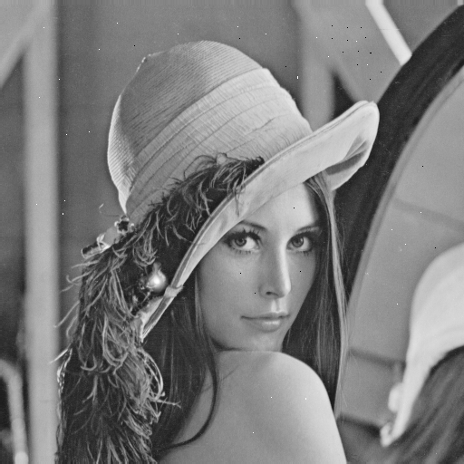
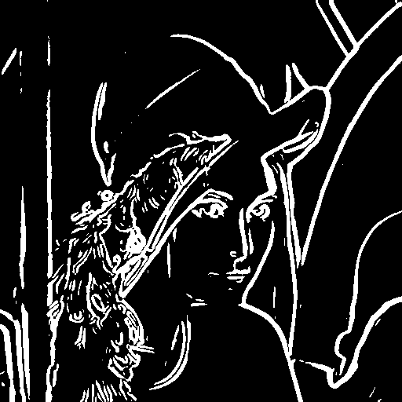

Image Processing Pipeline
=========================

  
  

This project is a Java-based implementation designed to apply a series of image processing techniques to a given image. It utilizes the power of various algorithms and filters to process and enhance images.

## Overview

### Main Components

1. **Main**: The driver class that orchestrates the various steps in the image processing pipeline.
2. **Gaussian2D**: Implements the Gaussian 2D filter or related operations.
3. **Percentile**: Provides methods to calculate percentiles.
4. **Reflection**: Handles operations related to reflection transformations.
5. **Statistics**: Contains statistical functions or methods.
6. **OtsuBinarize**: Implements the Otsu binarization method.
7. **Sobel**: Provides the Sobel edge detection filter or related operations.
8. **MedianFilter**: Implements the median filtering method.

### Main Functionality

The pipeline processes an image through various stages:
- **Percentile Calculation**: This stage likely helps in thresholding or normalization.
- **Reflection Transformation**: The image is subjected to reflection transformations.
- (Other stages would be described based on the full content of the `Main.java` file and other related files.)

## Execution

To run the processing pipeline:

(Note: Execution instructions should be added here based on the project's build and run requirements.)

## Input and Output

- **Input Image**: The default image is "A_Lenna.png", located in the `src/image` directory.
- **Output Image**: The processed image is saved as "A_Final.png" in the `src/image` directory.

## Dependencies

Ensure you have the required libraries and dependencies to run Java applications that utilize the BufferedImage class for image handling.

